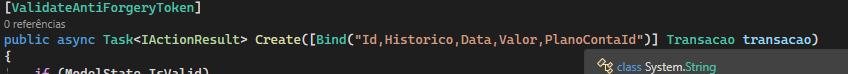

# MyFinance Web

Aplicação de controle financeiro via web para registrar receitas e gastos

## Arquitetura Utilizada

- MVC

## Tecnologias

- ASP.NET MVC
- Entity Framework
- SQL Server
- Bootstrap

## Configuração para Startup do Projeto

Necessário ter o .Net 8 ou superior, Sql Server e Visual Studio Code instalado.

1. Clone o repositório.
2. Configure a string de conexão do banco no arquivo `MyFinance Web\Infrastructure\MyFinanceDbContext.cs`.
4. Execute o projeto a partir do Visual Studio 2022.

## Estrutura do Projeto

- **Controllers:** PlanoContaController, TransacaoController
- **Domain:** PlanoConta, Transacao
- **Infrastructure:** MyFinanceDbContext
- **Models:** ErrorViewModel, TransacaoCreateModel
- **Views:** CRUDs para PlanoConta e Transacao

## Observações

Optei por não usar mappers customizados para utilizar o mapeamento nativo do .Net na declaração das ações conmo no exemplo abaixo.

